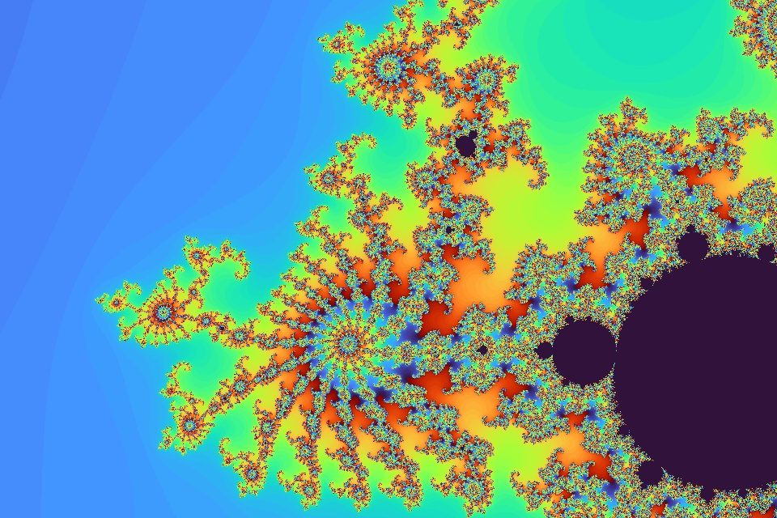

# Creating Mandelbrot fractals using CUDA

The Mandelbrot images are calculated on the GPU using CUDA via the Numba library. The result is shown on a web page at http://localhost:12345 where it is possible to zoom and pan using the keyboard (w,a,s,d,j,k,l).

Tested on Ubuntu 22.04 LTS with these dependencies:

sudo apt install nvidia-cuda-dev nvidia-cuda-toolkit

A non-ancient NVIDIA GPU is required.

